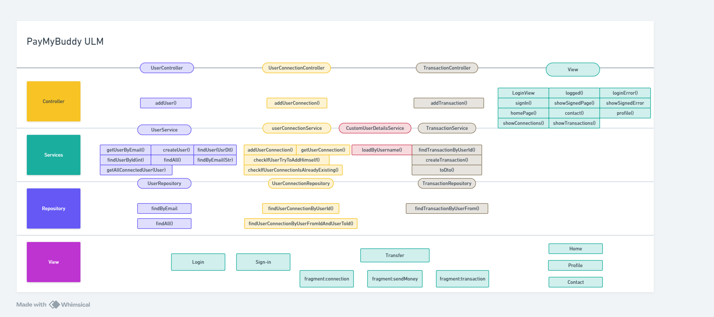
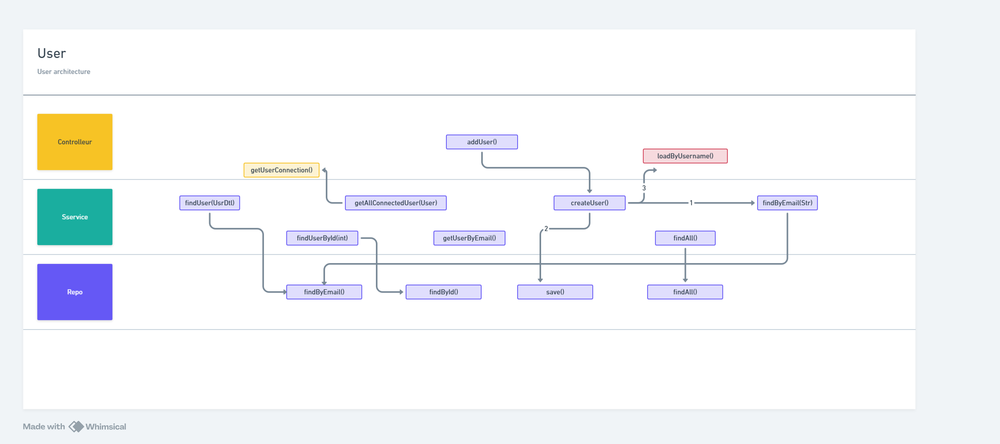
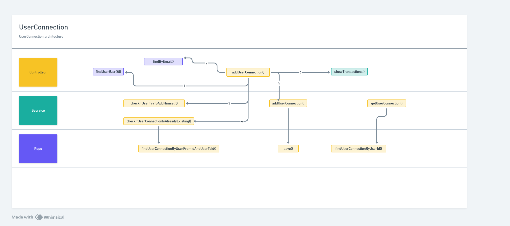
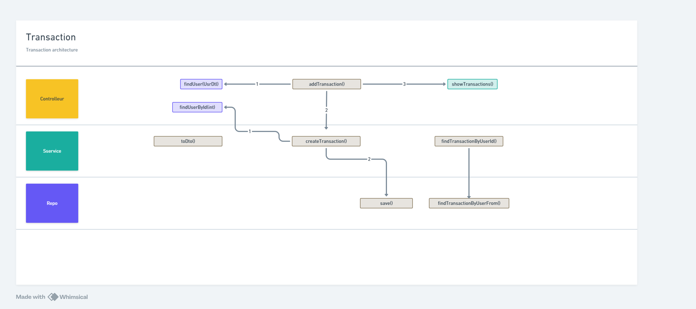
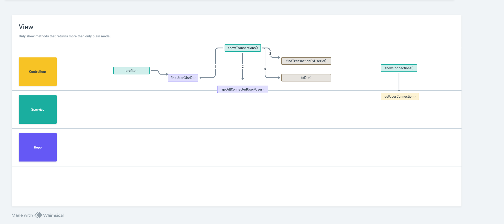

# PayMyBuddy

## Description
Application destiné à effectuer des transactions entre particuliers

## Modèle de données
[![Aperçu de l'application]](paymybuddy/domaine.png)
[![Aperçu de l'application]](paymybuddy/domaine2.png)

## Entités 


## ULM


### User


### UserConnection


### Transaction


### View


## Installation
1. Clonez le dépôt :
   ```sh
   git clone https://github.com/jonathan-robin/OC_PayMyBuddy.git
